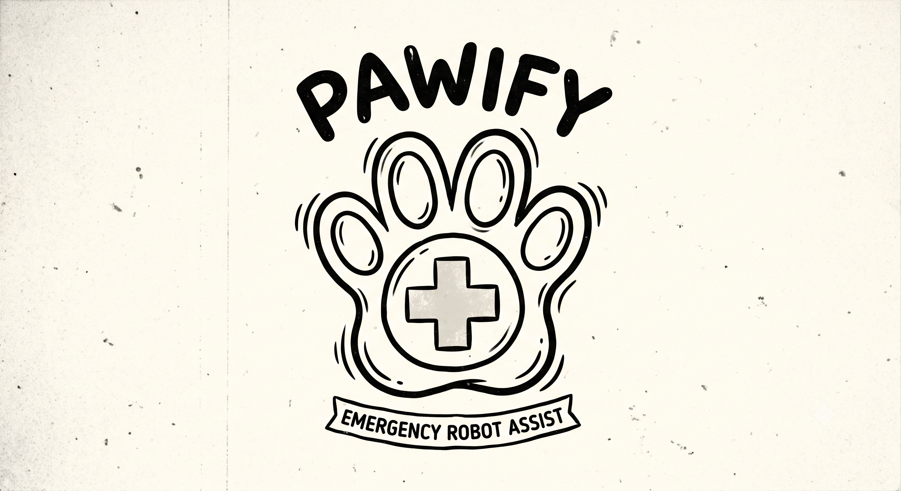
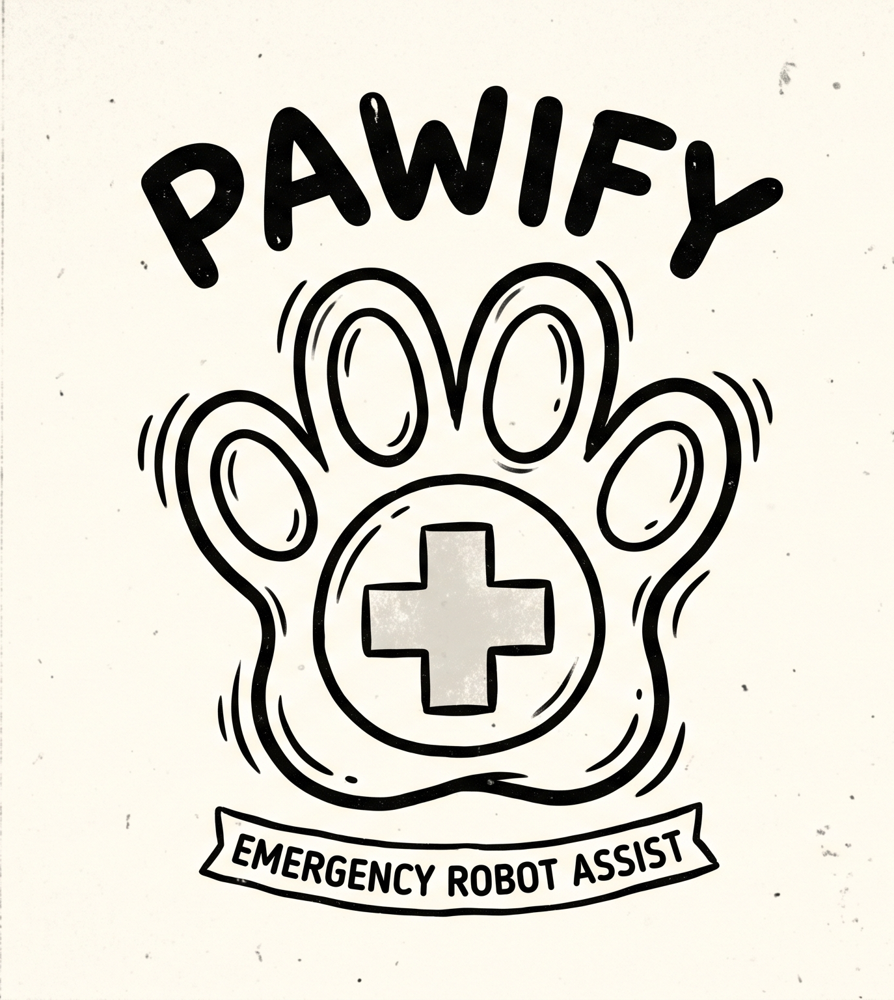

  

<h1 align="center">PAWIFY</h1>

<em>"If you can shake you are safe."</em>

  

## The Global Problem: Fatal Response Delays & Missing Telemetry

Every year, emergency services handle over 100 million distress calls worldwide. However,
traditional emergency medical services face critical bottlenecks:

- **Dangerous Response Delays**: In urban settings, traffic congestion keeps ambulance arrival
  times between 8 and 15 minutes. In rural, mountainous, or isolated areas, response times
  frequently stretch to 15 to 30+ minutes.
- **The "Golden Minutes" Risk**: For severe medical events (such as cardiac arrest, trauma, or
  severe bleeding), survival rates drop by 7% to 10% for every minute that elapses without first
  aid.
- **The Location & Communication Gap**: Isolated victims often cannot speak, dial a phone, or give
  exact addresses. When first responders arrive without knowing the patient's precise spot or
  condition, vital time is lost searching on foot.

## Our Solution: Autonomous Quadruped Rescue

Built during AdventureX 2026, Pawify is an end-to-end, autonomous emergency response ecosystem. It
bridges the gap between the onset of a medical crisis and the arrival of human paramedics by
delivering physical medical aid and live tele-triage within minutes.

When a user is isolated or incapacitated, a simple gesture triggers an automated rescue
chain—dispatching a Unitree Go2 Air robot directly to their location while giving medical teams
live communication channels.

## Key Components & How It Works

1. **Gesture-Triggered Emergency Alert (Smart Ring)** — a user wearing a smart ring triggers an
   instant distress signal simply by shaking their hand. This removes the need to locate, unlock,
   or speak into a phone during a medical emergency. See [`ring_sound_SDK/`](ring_sound_SDK/) and
   the RING section of [`README_dog_&_ring.md`](README_dog_&_ring.md) — the `sos_shake_hand`
   gesture is the only one that triggers anything; everyday movement (`idle`, waving, walking) is
   deliberately ignored.

2. **Victim GPS Pinpointing (Mobile App)** — the distress signal pairs with a mobile mapping
   application ([`pawify/`](pawify/), the Flutter app) that lets a responder drop a pin on the
   victim's map location and extracts high-precision GPS coordinates. It runs a small local HTTP
   API (`/health`, `/points`, `/nearest`, `/nearest-gps`) that the robot side queries
   (`dog_function/robot_api.py`) to fetch the nearest marked position and initiate the robot's
   dispatch sequence.

3. **LiDAR-Powered Autonomous Navigation** — running on
   [DimOS (Dimensional)](https://github.com/dimensionalOS/dimos), the Unitree Go2 Air quadruped
   robot deploys to the coordinates. Instead of relying purely on GPS signal strength in dense or
   wooded areas, the robot uses its onboard LiDAR sensors to map surroundings in real time, detect
   obstacles, climb stairs, and navigate rough terrain directly to the victim. See the DOG section
   of [`README_dog_&_ring.md`](README_dog_&_ring.md) and [`dog_function/`](dog_function/)
   (relocalization/navigation blueprint, `send_goal.py`).

4. **First-Aid Kit Transport** — the robot acts as an immediate physical first-responder, carrying
   an onboard medical supply kit straight to the injured individual far faster than standard
   ground transport.

5. **Medical Command Dashboard (Doctor GUI)** — doctors and emergency personnel monitor the rescue
   from a dedicated desktop command center, [`dog_function/pawify.py`](dog_function/pawify.py).
   Once the robot reaches the victim, medical staff receive real-time status telemetry (camera,
   obstacle distance, map/pose) and establish live two-way audio communication through the
   robot—allowing doctors to assess the patient and guide them through self-care while paramedics
   are en route.

## Global Impact

Developed in China for worldwide adoption, Pawify redefines emergency response. By turning a
simple hand gesture into an immediate robotic response, Pawify slashes wait times for first-aid
supplies, eliminates search delays, and ensures that no one is truly alone during a
life-threatening crisis.

## Repository Guide

This repo is split by concern, each with its own deeper documentation:

| Path | What it is | Docs |
| --- | --- | --- |
| [`dog_function/`](dog_function/) | Robot-side Python: the `pawify.py` operator console, `send_goal.py` map/nav-goal sender, `robot_api.py` HTTP client, `direct_go2_move.py` connection/movement layer, and the `robot_dog_functions.py` helper layer for a phone-facing FastAPI service. | [`README_dog_&_ring.md`](README_dog_&_ring.md) (DOG section), [`dog_function/HANDOVER.md`](dog_function/HANDOVER.md) |
| [`ring_sound_SDK/`](ring_sound_SDK/) | The smart ring's single-file BLE SDK (`ring_sound.py`), gesture collection/classification pipeline, and the `demo_gesture.py` script that ties an `sos_shake_hand` detection to a Go2 trigger. | [`README_dog_&_ring.md`](README_dog_&_ring.md) (RING section), [`ring_sound_SDK/README.md`](ring_sound_SDK/README.md), [`ring_sound_SDK/ring_sound_use.md`](ring_sound_SDK/ring_sound_use.md), [`ring_sound_SDK/protocol.md`](ring_sound_SDK/protocol.md) |
| [`pawify/`](pawify/) | The victim-side mobile app (Flutter, git submodule) — map pinpointing + local HTTP API for the robot side to query. | [`pawify/README.md`](pawify/README.md) |
| DimOS | Not vendored here — the navigation/relocalization stack the Go2 runs on. | <https://github.com/dimensionalOS/dimos>, <https://dimensionalos.mintlify.site/capabilities/navigation/relocalization> |

For setup (Python version, dimOS install, BLE dependencies, `ffmpeg`, robot connection secrets)
and exact run commands for every app above, start with
[`README_dog_&_ring.md`](README_dog_&_ring.md).

## License

Licensed under the Apache License 2.0 — see [`LICENSE`](LICENSE). `pawify/` is a separate git
submodule (<https://github.com/itsleatch/pawify.git>) and may carry its own licensing.

## Questions

What did we make and who will use it?

Why did you choose this topic?

What is the robot doing specifically?

What capabilities did you use (navigation/perception/memory/voice/LLM integration...) and what additional human intervention did you implement?

Which parts are remotely controlled and which run automosly?

Is your project commercially viable?

Who will fund it?

Who are the users?

All the people, in some places or zones that 

