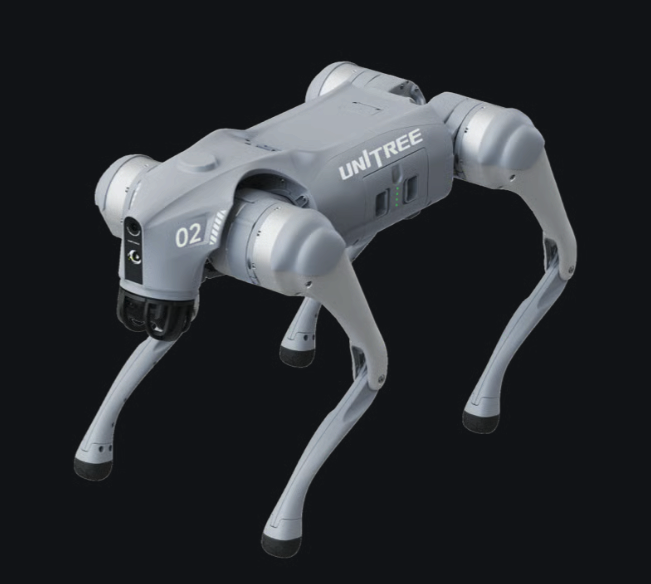
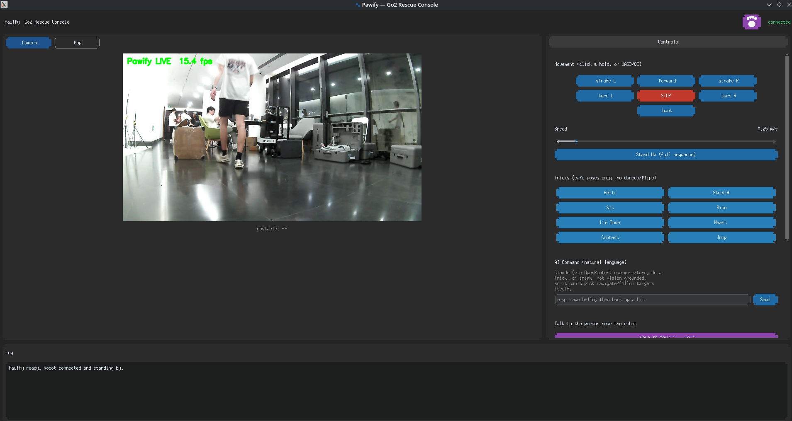
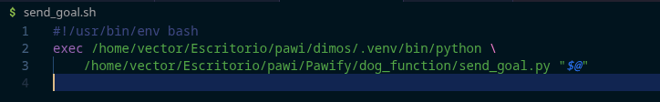
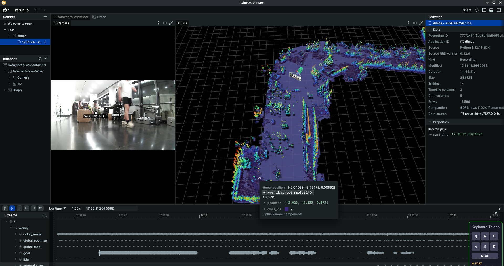

# DOG (UNITREE GO2)



Python tooling that turns a Unitree Go2 (running [dimOS](https://github.com/dimensionalOS/dimos)) into a
rescue/operator platform: a full teleop + camera + talk console (`pawify.py`), a lightweight
map/nav-goal sender (`send_goal.py`), and a small HTTP bridge for a phone app (`robot_api.py` +
`robot_dog_functions.py`).

## FUNCTIONS

All of these live in [`dog_function/`](dog_function/).

- **`pawify.py`** — the main operator console ("🐾 Pawify — Go2 Rescue Console"). One
  `customtkinter` window with:
  - live camera feed + nearest-obstacle readout (from the robot's lidar),
  - held-key or WASD/QE movement, a safe trick panel (no dances/flips — see `SAFE_TRICKS`),
  - push-to-talk + best-effort "Listen to robot's mic" audio,
  - a natural-language "AI Command" box (Claude via OpenRouter, tool-calling — not
    vision-grounded),
  - **Navigate mode**: since the Go2 only accepts one WebRTC peer at a time, entering this mode
    closes Pawify's own teleop connection, launches the DimOS `unitree-go2-relocalization`
    blueprint as a subprocess, and renders *that* blueprint's live costmap + robot pose inside
    Pawify's own window (click-to-send-goal). Exiting reconnects teleop.

  Built on top of `direct_go2_move.py` (reused for the connection, movement ramping, and trick
  tables — `dg2.*` in the code).

- **`direct_go2_move.py`** — the shared connection/movement layer: opens the `UnitreeWebRTCConnection`,
  builds/ramps `Twist` commands, holds the `SPORT_COMMANDS` trick table, and doubles as a
  standalone terminal tool via `--interactive` (WASD/QE + typed commands like `jump`, `hi`, `stand`)
  if you don't need camera/audio/UI.

- **`robot_api.py`** — a tiny `requests`-based HTTP client for a separate device/API
  (`fetch_health_status()` → `GET /health`, `fetch_nearest_gps()` → `GET /nearest-gps`). Used by
  `send_goal.py`'s 📍 button to pre-fill a candidate goal from the nearest known GPS fix.

- **`send_goal.py`** — a standalone `customtkinter` map/goal sender for an **already-running**
  DimOS navigation blueprint. It renders the blueprint's live costmap + robot pose (read straight
  off its LCM pub/sub bus — the same topics Pawify's own Navigate mode uses) and lets you click the
  map, or type x/y, to publish a goal to `/target`; it can also cancel navigation via
  `/stop_movement`. It never touches the robot's WebRTC/teleop connection, so it's safe to run
  alongside Pawify or entirely on its own — it only talks to DimOS's pub/sub bus, never competes
  for the Go2's one-peer WebRTC slot, and it doesn't start or stop the blueprint itself.

- **`robot_dog_functions.py`** / **`__init__.py`** / **`HANDOVER.md`** — a separate, lighter-weight
  helper layer meant for a phone-app-facing service rather than the desktop console:
  `make_twist`, `publish_cmd_vel`, `emergency_stop`, `come_find_me`, and `create_app()` (a FastAPI
  app exposing `GET /health`, `GET /camera.mjpeg`, `POST /cmd_vel`, `POST /emergency`,
  `POST /come-find-me`). See `HANDOVER.md` for the full API/testing notes — it's the canonical doc
  for this module.

- **`test.py`** — minimal smoke test: boots the plain `unitree-go2` blueprint via dimOS's `Dimos`
  class directly and issues one `relative_move`.

## EXECUTION

### Pawify console (camera, controls, talk, AI, Navigate mode)

```
cd Pawify/dog_function
python pawify.py --ip <ROBOT_IP> --aes-key <UNITREE_AES_128_KEY>
```

If `dimos/.env` already has `ROBOT_IP` / `UNITREE_AES_128_KEY` (see PREREQUISITES below), the
flags aren't needed and it's just:

```
python pawify.py
```

Useful flags (full list: `python pawify.py --help`, extends `direct_go2_move.py`'s parser):
`--map-file <name>` (premap for Navigate mode, default `recording_go2`), `--nav-blueprint <name>`
(default `unitree-go2-relocalization`), `--speed`, `--no-obstacle-avoidance`,
`--openrouter-key <key>`.





### Map sender / Interactive map (`send_goal.py`)

`send_goal.py` is a client only — it needs a DimOS navigation blueprint already running (either
started standalone, below, or via Pawify's own Navigate mode, since both read/write the same LCM
topics).

- Create a `./send_goal.sh` wrapper and put inside:
    ```bash
    #!/usr/bin/env bash
    exec dimos/.venv/bin/python \
        /Pawify/dog_function/send_goal.py "$@"
    ```
- Execution: `./send_goal.sh`



### DimOS relocalization blueprint (standalone)

```
cd Pawify/dog_function
dimos run unitree-go2-relocalization \
    -o relocalizationmodule.map_file=recording_go2
```

`recording_go2` is the shared basename of the pre-scanned map files (`recording_go2.db`,
`recording_go2.pc2.lcm`, `recording_go2.rrd`) — see PREREQUISITES. Run this by hand only when you
want the blueprint up **without** Pawify's teleop UI in front of it (e.g. driving purely through
`send_goal.py`, or debugging the blueprint on its own); Pawify launches/stops this same command
itself when you toggle Navigate mode.



## PREREQUISITES

- Install dimOS from <https://github.com/dimensionalOS/dimos> — provides the `dimos` CLI, the
  `unitree-go2` / `unitree-go2-relocalization` blueprints, and the `dimos.*` Python packages
  (`dimos.core.transport`, `dimos.msgs.*`, `dimos.robot.unitree.connection`, …) all of these
  scripts import.
- Python at least 3.12 (developed against 3.12.13). Everything here is meant to run inside dimOS's
  own virtualenv (`dimos/.venv`), so `dimos`, `direct_go2_move`, and the DimOS Python packages are
  all importable from the same interpreter.
- Python libraries (`pip install` into that same venv):
  - `requests` — `robot_api.py`'s HTTP client.
  - `customtkinter`, `numpy`, `Pillow` — the `pawify.py` / `send_goal.py` GUIs (map rendering,
    image widgets).
  - `opencv-python` (`cv2`) — Pawify's video feed decode/overlay.
  - `sounddevice` — Pawify's push-to-talk mic recording and "Listen" playback.
  - `av`/aiortc's audio-frame support — used by `RobotListener` to decode the robot's WebRTC audio
    track (brought in with dimOS's WebRTC stack; verify it's present if "Listen" doesn't work).
  - `unitree_webrtc_connect` — the Unitree WebRTC driver `direct_go2_move.py` connects through.
  - `openrouter` — only needed for the "AI Command" box (`pip install openrouter`, and set
    `OPENROUTER_API_KEY`).
  - `pyttsx3` — only needed for the typed "Say" feature (offline TTS, no API key). On Linux it
    also needs the `espeak-ng` system package.
  - `fastapi` + `uvicorn` — only needed if you run `robot_dog_functions.create_app()` (see
    `HANDOVER.md`), not for `pawify.py`/`send_goal.py`.
- Robot connection secrets — `ROBOT_IP` and `UNITREE_AES_128_KEY` (Go2 WebRTC IP + AES key), and
  optionally `OPENROUTER_API_KEY`. Set them via `--ip`/`--aes-key`/`--openrouter-key` flags or a
  `dimos/.env` file (auto-loaded by `direct_go2_move.py`).
- A pre-scanned map: matching `.db`, `.pc2.lcm` and `.rrd` files (same basename) produced by
  dimOS's relocalization capability — see
  <https://dimensionalos.mintlify.site/capabilities/navigation/relocalization>.
- Licensed under the Apache 2.0 License — see [`LICENSE`](LICENSE) at the repo root. This covers
  this repository's own code; dimOS and other third-party dependencies carry their own licenses.

# RING

A Bluetooth-connected "smart ring" (voice recording + IMU gesture sensing) with a single-file
Python SDK, in [`ring_sound_SDK/`](ring_sound_SDK/). Talks to the ring over BLE (Nordic UART
Service) using a custom binary v4 protocol.

**Purpose.** The ring is worn on the person's hand, and the one gesture that actually matters is
`sos_shake_hand` — a deliberate shake used as a help signal. The trained classifier
(`gesture_detector.py` + `gesture_model.json`) also recognizes `idle`, `normal_raise`,
`normal_shake`, `normal_wave` and `walking`, but those exist only as negative examples so the SOS
detector doesn't false-trigger on everyday movement — none of them do anything on their own. Only
a classification of `sos_shake_hand` can (optionally, see `demo_gesture.py` below) trigger the
Go2; everything else — including plain `idle` — is a no-op, nothing is sent to the dog.

## FUNCTIONS

- **`ring_sound.py`** — the SDK itself (single file, `import ring_sound as sdk`). BLE
  scan/connect, protocol framing + CRC, system info, logs, time sync, audio recording
  download/decode (Speex → WAV via `ffmpeg`), real-time IMU (`0x0605`), and gesture/button events
  (`0x0701`–`0x0704`). Also works as a CLI (see EXECUTION below). `__all__` is the authoritative
  list of public names.
- **`find_ring.py`** — scans for nearby BLE rings and prints address/RSSI/services, to find a
  ring's MAC address before hardcoding it elsewhere.
- **`collect_imu.py`** — connects to a ring and logs raw `0x0605` IMU batches to CSV; the shared
  building block the gesture-collection scripts below import.
- **`collect_gesture_set.py`** — drives `collect_imu.py` through a scripted sequence of labeled
  gesture recordings, to build a training set under `gesture_data/` / `gesture_raw/`.
- **`gesture_session.py`** — an interactive recording session wrapper around
  `collect_gesture_set.py` / `collect_imu.py`.
- **`gesture_detector.py`** — offline feature extraction + classification over recorded IMU CSVs
  (segmentation, template matching against `gesture_model.json`, plus SOS-specific vote/gyro
  thresholds — `sos_min_votes`, `sos_min_gyro_rms`, `sos_min_gyro_peak` — so a shake has to clear a
  higher bar than a generic template match before it's called `sos_shake_hand`). No BLE connection
  needed; works offline on any recorded CSV.
- **`find_gesture_ring.py`** — scans for nearby rings and probes each one with
  `start_sensor_report()` to find whichever one is *currently in gesture mode* (recording mode
  rejects it with "device busy"), since the SDK can't just ask the ring what mode it's in.
- **`demo_gesture.py`** — the actual ring→dog integration point. Connects to a ring, records a
  short IMU sample on each Enter keypress, classifies it, and prints the decision. Only
  `sos_shake_hand` does anything further — `idle`/`normal_*`/`walking` are printed and dropped.
  Even on SOS, robot triggering is opt-in and off by default: pass `--go2-direct-on-sos` (direct
  WebRTC move via `direct_go2_move.py`) or `--dimos-on-sos` (a DimOS `relative_move`) to actually
  move the Go2, and an 8s cooldown (`--sos-cooldown`) stops one shake from firing repeated moves.
  With neither flag it just logs "SOS detected. Robot trigger is disabled..." — useful for testing
  the detector without touching the robot.
- **`demo.apk`** — a compiled Android/uni-app companion app (BLE connect, playback, IMU/gesture
  view). Independent of the Python SDK — not a runtime dependency of anything above.
- **`戒指打印模型/`** — STEP CAD files for the ring's 3D-printable shell/ring/button. Mechanical
  reference only, unrelated to the SDK's software interface.
- **`README.md`** (SDK internals/layering/protocol framing/audio format), **`ring_sound_use.md`**
  (the call reference — install steps, every public function/type, examples), **`protocol.md`**
  (raw v4 command/field tables) — all in Chinese, and the canonical docs for anything not covered
  here. Prefer `ring_sound_use.md` for "how do I call X", `protocol.md` for exact byte layouts,
  and `README.md` for the why/architecture behind them.

## EXECUTION

The ring has two device-side modes (recording / gesture), switched by a single click on the ring
itself; a long-press does the actual recording or gesture capture depending on which mode it's in.

### Find the ring's MAC address

```
python find_ring.py
```

### Quick SDK checks (CLI built into `ring_sound.py`)

```
python ring_sound.py scan --address <MAC>
python ring_sound.py connect --address <MAC>
python ring_sound.py info --address <MAC>
python ring_sound.py audio-count --address <MAC>
python ring_sound.py audio-download --address <MAC> --file-index 0 --output audio
python ring_sound.py time-sync --address <MAC> --seconds 60
```

### Collect IMU / build a gesture dataset

```
python collect_imu.py --address <MAC>
python collect_gesture_set.py --address <MAC>
python gesture_session.py --address <MAC>
```

### Live gesture demo (connect + classify + optional dog trigger)

Detect-only (prints the decision for every gesture, never touches the robot):

```
python demo_gesture.py --address <MAC>
```

With the Go2 wired up, so an `sos_shake_hand` decision actually moves it (idle/normal gestures
still do nothing):

```
python demo_gesture.py --address <MAC> --go2-direct-on-sos --go2-ip <ROBOT_IP> --go2-aes-key <UNITREE_AES_128_KEY>
```

(or `--dimos-on-sos` to route the trigger through a running DimOS instance instead of a direct
WebRTC move — see `--dimos-cmd`/`--dimos-dir`).


## PRERREQUISITES

- Python 3.11 or newer (the SDK uses `asyncio` throughout; every BLE-facing function is an
  `async def` called with `await`).
- `bleak` — required for all BLE communication: `python -m pip install bleak`.
- `ffmpeg` on `PATH` (`ffmpeg -version` should work) — only needed to decode downloaded recordings
  (Speex → WAV) via `save_audio_bundle()`/`decode_audio_to_wav()`. Downloading raw audio bytes
  works without it; decoding raises `SpeexDecoderUnavailable` if it's missing.
- Linux: the BlueZ Bluetooth stack, plus BLE permissions for the current user (verify the ring's
  MAC is visible to the system Bluetooth tools first if scanning/connecting misbehaves).
- The ring's BLE MAC address (SDK filters by MAC, not by advertised name — use `find_ring.py` or
  `scan_rings()` to get it).
- Licensed under the Apache 2.0 License — see [`LICENSE`](LICENSE) at the repo root.
